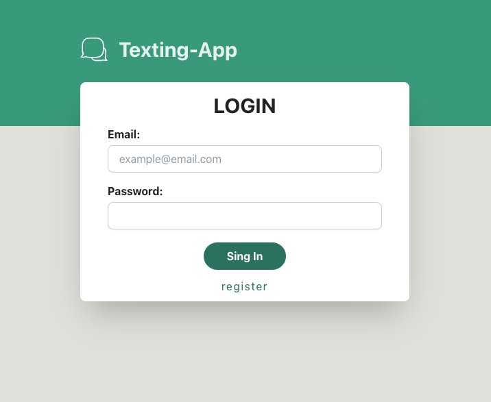
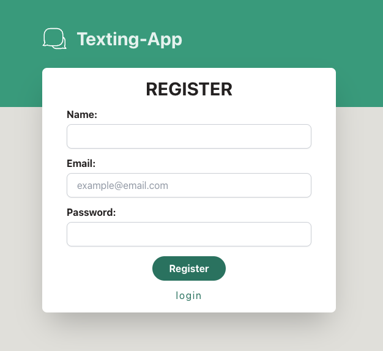
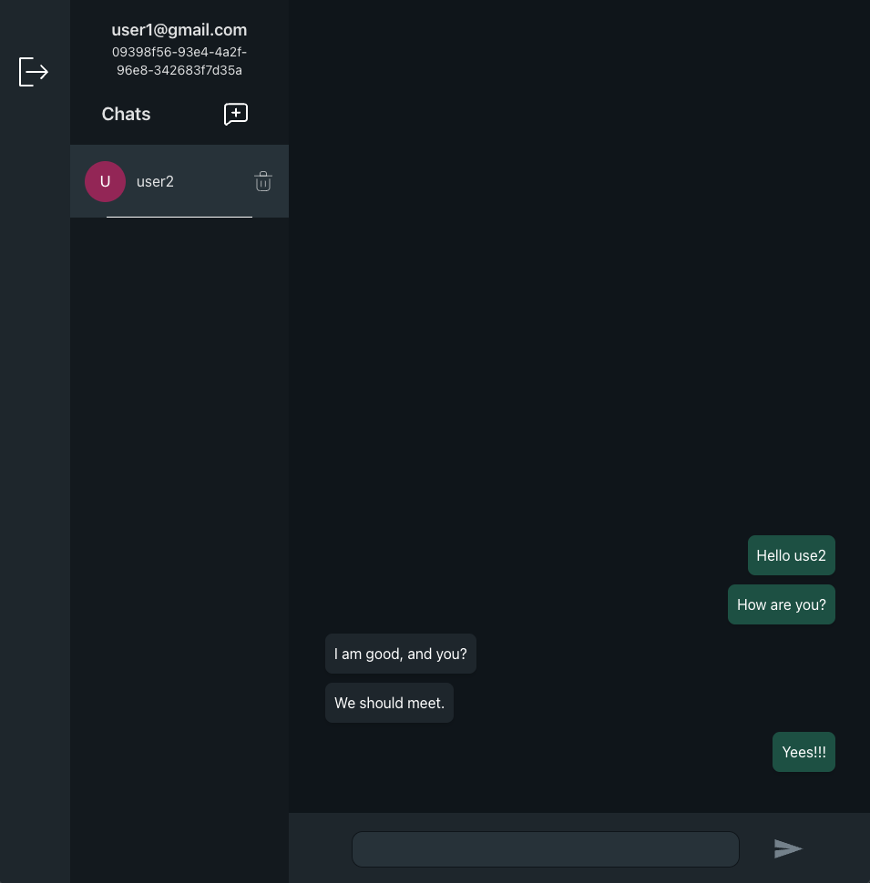
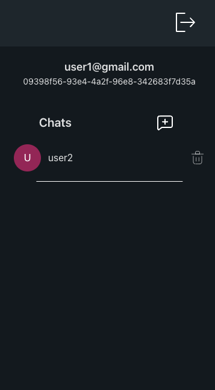
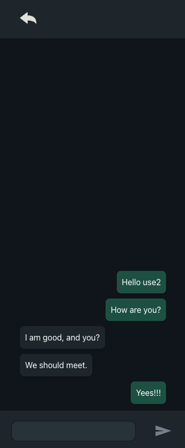

# Frontend Texting-App
This is the front end of texting-app. Here, we explain all you need to use the frontend.

- [Frontend Texting-App](#frontend-texting-app)
    - [Installation 🚀](#installation-)
    - [Functionalities 🚀](#functionalities-)
        - [Login Page](#login-page)
        - [Lobby Page](#lobby-page)
          - [(Landscape)](#landscape)
          - [(Mobile)](#mobile)
    - [Build with 🔨](#build-with-)
    - [Author 👑](#author-)


### Installation 🚀

Clon the repository
```
git clone https://github.com/Rafael3994/texting-app.git
```
Go the frontend folder and install the dependencies.
```
cd apps/frontend

## npm:
npm install 
```
Copy the file .env.template and remove the .template. With this, fill the filds in the file
```
## URL from the backend.
 VITE_BACKEND_URL=
```
Start the project.
```
npm run dev
```

### Functionalities 🚀
```
http://localhost:5173
```
In this section, we explain how to use of the app.
The app is totally responsive, you can use it on any device.
Exist two main pages, the login and the lobby.

##### Login Page


<small>Here, you'll can login or register in the app.</small>

##### Lobby Page
###### (Landscape)

<small>On the left side, there is the sidebar with the button to do logout. Next the cheat menu, and the clipboard. On the chat menu, you have the id of your user, the button to create a new chat, and the list of chats. To create a new chat, need the user id from the user that you want to chat. In the clipboard, you can see the messages that you send and the messages that the other user send.
You can delete the chats with the trash icon.
On the clipboard, you can see the messages that you send and the messages that the other user sends. To delete your message, click the right button of your mouse.
</small>

###### (Mobile)


<small>The logic is the same, but change the format, the only new thing to comment is on the clipboard, there is a new button to go to the chat list</small>

<!-- 
### Testing 🚧
-->

### Build with 🔨
* [Node.js](https://nodejs.org/es/) - Runtime
* [React](https://es.react.dev/) - Frontend Library
* [Typescript](https://www.typescriptlang.org/) - Programming Language
* [Socket.io](https://socket.io/) - WebSocket
* [Tailwindcss](https://tailwindcss.com/) - Css Framework
* [React Router Dom](https://reactrouter.com/en/main) - Router Library
  
### Author 👑
Rafael Garcia Perez
[GitHub - Rafael3994](https://github.com/Rafael3994)
[Linkedin - Rafael3994](https://www.linkedin.com/in/rafael3994/)